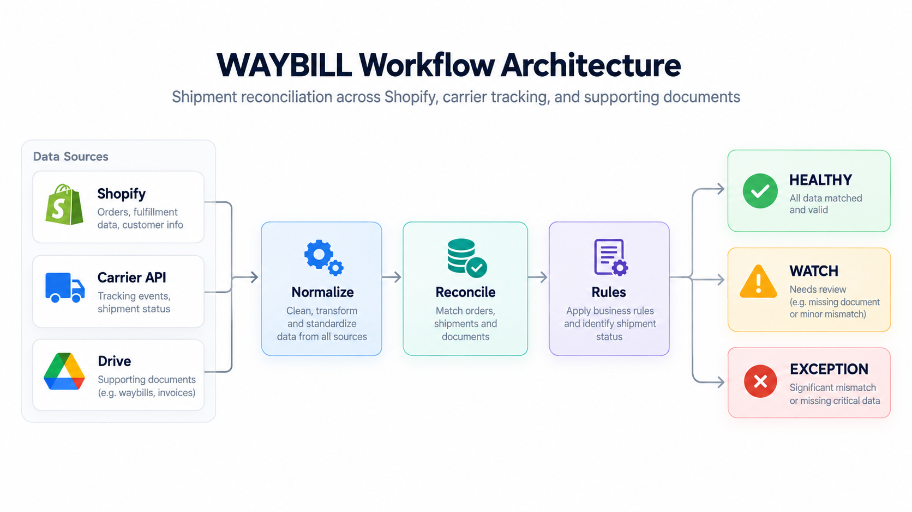
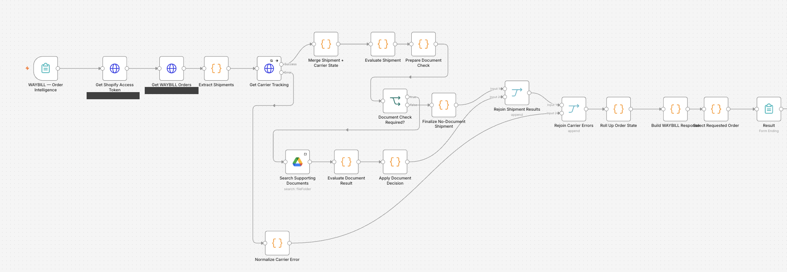

# WAYBILL — Multi-System Shipment Reconciliation

**Order status is split across Shopify, the carrier and a folder of delivery documents. WAYBILL is an n8n workflow that pulls all three together, applies explicit rules, and tells you which orders need attention and why.**

| | |
| --- | --- |
| **Connects** | Shopify Admin GraphQL · carrier tracking REST API · Google Drive |
| **Decides with** | explicit JavaScript rules, no AI |
| **Returns** | `HEALTHY` / `WATCH` / `EXCEPTION` per order, with issue codes and recommended actions |
| **Handles failure** | failed carrier calls get their own branch → `WATCH` + `RETRY_CARRIER` instead of a silent gap |
| **Status** | portfolio implementation with synthetic fixtures; not a production deployment, no measured business results |

```text
Order lookup form → Shopify GraphQL → shipment extraction
  → carrier tracking → normalize and match by tracking number
  → shipment rules → supporting-document lookup when required
  → order rollup → HEALTHY / WATCH / EXCEPTION → form result

Carrier request failure → recover shipment → WATCH / RETRY_CARRIER
```



*Original architecture graphic. The exported rules define the precise status boundaries: a missing required document becomes `EXCEPTION`, not `WATCH`.*

## What's in this repo

- [`workflow/waybill.json`](workflow/waybill.json): the exported n8n workflow (inactive, credentials removed)
- [`tests/smoke.mjs`](tests/smoke.mjs): runs the exported rule and normalization code against synthetic cases
- [`examples/`](examples/): a synthetic input and the output the workflow code produces for it
- [`docs/implementation-notes.md`](docs/implementation-notes.md): carrier contract and known limits

## Why this exists

Checking an order manually means looking it up in three systems and deciding which source to trust when they disagree. That repeated lookup-and-compare is the work WAYBILL automates. The judgment calls stay explicit: every status comes with the issue codes that caused it.

## How it works

1. **Retrieve fulfillments.** Obtain a Shopify access token and query the first 50 orders tagged `waybill-fixture`. Extract tracked fulfillments from orders with a `WB-<digits>` tag.
2. **Reconcile carrier state.** Match responses to shipments by tracking number, not array position. Carry forward the latest event, proof-of-delivery availability, tracking replacement metadata, and delivery anomalies.
3. **Evaluate shipment rules.** Check tracking mismatches, delivery anomalies, failed attempts, unverified delivery documents, and tracking that has stalled for more than three days.
4. **Check supporting documents.** Search Google Drive when proof of delivery or customs evidence is needed. The workflow uses tracking numbers and a small fixture-specific legacy order-reference mapping. Document matching checks filenames; it does not inspect document contents.
5. **Roll up the order.** The highest shipment severity determines the order state. The response includes shipment details, unique issue codes, recommended actions, and an attention flag.

| State | Implemented examples |
| --- | --- |
| `HEALTHY` | Delivered with available proof of delivery; required POD found in Drive |
| `WATCH` | Failed delivery attempt; customs hold with a document; recoverable carrier request failure |
| `EXCEPTION` | Delivery anomaly; stalled tracking; required supporting document missing |

Actions such as `CREATE_SUPPORT_TASK` are recommendations in the output. This export does not create tickets or send notifications.

## Reliability / edge cases

The carrier HTTP node has retries enabled and routes failures to a separate normalizer. When the tracking number can be recovered from the error payload, the shipment still receives `WATCH`, `CARRIER_API_UNAVAILABLE`, and `RETRY_CARRIER`. Successful and failed carrier results rejoin before the order rollup.

The order form returns `NOT_FOUND` when its requested ID is absent from the evaluated results. Orders without a recognized tag and fulfillments without tracking numbers are skipped during extraction.

There are limits: Shopify and Drive failures do not have equivalent recovery paths; an unmatchable carrier error has no usable shipment status; empty successful carrier responses can retain the default `HEALTHY` state. The document matcher labels any positive match count `FOUND`, so the downstream `AMBIGUOUS` branch is currently unreachable. See [implementation limits](docs/implementation-notes.md) before adapting the workflow to live operations.

## Tech stack

- n8n forms, HTTP Request, Code, IF, Merge, and Google Drive nodes
- Shopify Admin GraphQL and client-credentials token exchange
- Carrier REST API response normalization
- JavaScript business rules and JSON output

## Screenshots



*Original n8n canvas, cropped; private Shopify endpoint labels are redacted. The lower branch handles carrier request failures.*

## Example

The [synthetic normalized shipment](examples/input.json) is delivered but has no carrier-provided POD. The example supplies an empty document search result, so the rules produce:

```json
{
  "status": "EXCEPTION",
  "status_label": "ACTION REQUIRED",
  "issues": ["POD_DOCUMENT_MISSING"],
  "recommended_actions": ["CREATE_SUPPORT_TASK"],
  "requires_attention": true
}
```

[Full output](examples/output.json) is generated by the exported Code nodes, not copied from customer executions. Run the local smoke checks to verify it:

```sh
node tests/smoke.mjs
```

These tests cover selected rule and normalization paths without calling Shopify, Drive, or a carrier. They do not certify n8n scheduling or live integration behavior.

## What this project demonstrates

- Multi-source reconciliation with explicit join keys
- Business rules with traceable issue codes and actions
- External API failure normalization
- Conditional document lookup and order-level aggregation
- Separation of operational status from recommended downstream action

## Running / importing the workflow

1. Import [workflow/waybill.json](workflow/waybill.json) into an isolated n8n instance. It is exported inactive.
2. Replace `YOUR_SHOP_DOMAIN`, `YOUR_SHOPIFY_CLIENT_ID`, and `YOUR_SHOPIFY_CLIENT_SECRET` with your own development-store configuration. Store secrets in your private n8n credential/configuration setup; do not save configured exports to this repository.
3. Configure a Shopify app allowed to read the queried orders and fulfillment fields. The export retains Admin API version `2026-07`; confirm that it is supported by your store.
4. Replace `YOUR_CARRIER_API_HOST`. The expected route is `/v1/tracking/<tracking-number>`; see the [carrier contract](docs/implementation-notes.md). The original integration used a local mock carrier exposed through a tunnel; the server and its data are not included.
5. Attach your own Google Drive OAuth2 credential to the search node. Use an isolated folder/account containing synthetic POD/customs files.
6. Prepare development-store orders with the `waybill-fixture` tag, a `WB-<digits>` tag, and tracked fulfillments. Open the **WAYBILL — Order Intelligence** test form and enter the fixture ID.
7. Inspect each branch with synthetic cases before activating anything. The exported manual trigger is disconnected; use the form path.

## Notes

Credentials, app identifiers/secrets, private endpoints, webhook identifiers, and installation metadata have been removed or replaced. The original customer fixtures, PDFs, execution data, and seeder workflows are excluded. Node IDs were regenerated; workflow connections and rule code were preserved. See [publication notes](docs/publication-notes.md).
